  
  
  
  
  
  

  

# 🔐 Awesome Adaptive Authentication & Risk-Based Access Control

> **A curated showcase of commercial SaaS platforms, open-source Identity & Access Management (IAM) systems, behavioral biometric risk engines, and Zero Trust security frameworks.**

---

## 📌 Overview & Key Concepts

**Adaptive Authentication** (also known as **Risk-Based Authentication (RBA)** or **Contextual Step-Up MFA**) dynamically assesses authentication risk at login or during user sessions. Instead of enforcing rigid multi-factor authentication (MFA) rules for every login, an adaptive risk engine evaluates contextual signals—such as geolocation, IP velocity, device fingerprints, network reputation, and behavioral biometrics—to calibrate authentication friction:

- 🟢 **Low Risk**: Frictionless login via single sign-on (SSO) or passwordless WebAuthn / Passkeys.
- 🟡 **Medium Risk**: Prompt for standard Step-Up MFA (TOTP, Push notification, WebAuthn).
- 🔴 **High Risk / Anomaly**: Trigger hard challenge, admin review, or automated login block.

---

## 📚 Table of Contents
- [🏢 SaaS & Commercial Platforms](#-saas--commercial-platforms)
- [🔓 Open-Source Repositories & IdPs](#-open-source-repositories--idps)
- [💡 Architectural Patterns](#-architectural-patterns)
- [🤝 How to Contribute](#-how-to-contribute)
- [💖 Support & Sponsorship](#-support--sponsorship)
- [📈 Star History](#-star-history)
- [⚖️ Disclaimer](#%EF%B8%8F-disclaimer)

---

## 🏢 SaaS & Commercial Platforms

> 📊 **Market Insights**: The global Adaptive & Risk-Based Authentication market is estimated at **~$15.2 Billion in 2026** and is projected to reach **~$34.5 Billion by 2030** (CAGR of ~18.5%). The market is **moderately fragmented**, featuring dominant cloud hyperscalers alongside specialized cybersecurity platforms delivering real-time threat intelligence and continuous behavioral biometrics.

The table below lists leading commercial SaaS identity providers and enterprise adaptive MFA platforms, **sorted by Company Size / Valuation (descending)**:

| Product Name 🚀 | Description 📝 | Starting Price 💵 | Free Tier / Trial Limits 🆓 | Company Size / Valuation 🏢 |
| :--- | :--- | :--- | :--- | :--- |
| **[Microsoft Entra ID Protection](https://www.microsoft.com/en-us/security/business/identity-access/microsoft-entra-id-protection)** | Automates risk detection and conditional access enforcement across Azure & Entra tenant sign-ins. | `$6.00 / user / month` (Entra ID P2 plan) | `30-day free trial` (up to 100 user licenses) | `$3.10 Trillion Valuation` ($245B Annual Rev) |
| **[IBM Verify](https://www.ibm.com/verify)** | Enterprise risk-aware Identity-as-a-Service (IDaaS) with machine-learning threat scoring and behavioral biometrics. | `$1.85 / user / month` (IBM Verify SaaS tier) | `30-day free trial` (full enterprise suite) | `$200.00 Billion Valuation` ($62B Annual Rev) |
| **[Cisco Duo](https://duo.com/)** | Adaptive MFA with device trust analysis, risk-based access policies, and continuous session verification. | `$3.00 / user / month` (Essentials tier; Duo Advantage with Risk Auth is `$6.00 / user / month`) | `Free forever up to 10 users` (Essentials tier); 30-day trial for enterprise | `$190.00 Billion Valuation` ($53B Annual Rev) |
| **[Okta Adaptive MFA](https://www.okta.com/)** | Contextual risk engine evaluating IP reputation, impossible travel, device trust, and behavior for step-up prompts. | `$3.00 / user / month` (Adaptive MFA add-on tier) | `30-day free trial`; Free Developer plan up to 7,400 Monthly Active Users | `$13.00 Billion Market Cap` ($2.5B ARR) |
| **[ForgeRock & PingOne Protect](https://www.pingidentity.com/)** | AI-driven continuous identity protection evaluating threat telemetry, behavioral dynamics, and device signals. | `$3.00 / user / month` (PingOne Protect tier) | `30-day free trial` (up to 100 users) | `$6.50 Billion Valuation` ($1.2B Combined Rev) |
| **[OneLogin SmartFactor](https://www.onelogin.com/)** | Adaptive access engine powered by Vigilance AI to challenge suspicious sign-in attempts dynamically. | `$4.00 / user / month` (Advanced Edition) | `30-day free trial` (all platform features) | `$3.50 Billion Valuation` ($1.0B Quest Rev) |
| **[RSA Adaptive Authentication](https://www.rsa.com/)** | Legacy-proven enterprise fraud prevention and risk scoring engine for banking and high-security apps. | `$2.50 / user / month` (Enterprise tier base) | `14-day free trial` (on-demand sandbox demo) | `$2.10 Billion Valuation` ($1.0B Annual Rev) |
| **[Silverfort](https://www.silverfort.com/)** | Unified identity protection platform extending adaptive MFA to legacy systems, service accounts, and cloud apps. | `$4.00 / user / month` (Enterprise base) | `14-day free trial` (guided PoC sandbox) | `$1.00 Billion Valuation` (Unicorn Status) |

---

## 🔓 Open-Source Repositories & IdPs

Open-source identity and access management platforms provide complete control over user data and customizable policy pipelines. The list below features prominent open-source IAM solutions, risk extensions, and behavioral engines, **sorted by GitHub Stars_Count (descending)**:

| Repository & Name 🌐 | Stars_Count Badge ⭐ | Description 📝 | Primary Language 💻 |
| :--- | :--- | :--- | :--- |
| **[Keycloak](https://github.com/keycloak/keycloak)** |  | Industry-standard open-source Identity and Access Management system supporting OIDC, SAML, conditional flows, and plugin risk modules. | Java |
| **[Authelia](https://github.com/authelia/authelia)** |  | Lightweight open-source authentication server providing two-factor authentication, single sign-on, and policy-based access control for reverse proxies. | Go |
| **[Authentik](https://github.com/goauthentik/authentik)** |  | Modern open-source identity provider emphasizing customizable stages, flow execution, conditional access policies, and WebAuthn support. | Python / Go |
| **[SuperTokens](https://github.com/supertokens/supertokens-core)** |  | Developer-first open-source auth architecture supporting session management, MFA, passwordless login, and custom risk-trigger hooks. | Java / TypeScript |
| **[ZITADEL](https://github.com/zitadel/zitadel)** |  | Cloud-native identity management platform built in Go with multi-tenancy, fine-grained RBAC, WebAuthn passkeys, and audit trails. | Go |
| **[Logto](https://github.com/logto-io/logto)** |  | Open-source Auth0 alternative providing developer-friendly UI, webhooks, multi-factor authentication, and extensible authentication pipelines. | TypeScript |
| **[Ory Kratos](https://github.com/ory/kratos)** |  | Headless, API-first identity and user management system implementing Zero Trust access control principles and cloud-native integration. | Go |
| **[Apereo CAS](https://github.com/apereo/cas)** |  | Enterprise Single Sign-On engine featuring native risk-based authentication triggers (RBA) based on IP velocity, geo-location, and past behavior. | Java |
| **[Keycloak Adaptive Auth Extension](https://github.com/mabartos/keycloak-adaptive-authn)** |  | Extension module for Keycloak enabling real-time risk scoring, machine learning risk estimation, and conditional step-up MFA. | Java |
| **[OpenBehavior-Auth](https://github.com/rugadameghanath/OpenBehavior-Auth)** |  | Lightweight open-source behavioral biometrics engine evaluating keystroke dynamics and pointer velocity for passive risk scoring. | Python |

---

## 💡 Architectural Patterns

Self-hosting adaptive authentication typically involves assembling modular open components:

1. **Identity Provider (IdP)**: Keycloak, Authentik, ZITADEL, or Authelia.
2. **Context Collector**: Client-side library capturing browser signals (IP, User-Agent, WebGL fingerprint, velocity).
3. **Risk Scoring Engine**: Custom microservice evaluating signals against threat feeds, rate limits, or ML models.
4. **Step-Up Verification Provider**: WebAuthn / Passkeys, TOTP apps (Google Authenticator, Authy), or SMS/Email OTP services.

---

## 🤝 How to Contribute

Contributions are highly welcome! Help us maintain the most comprehensive guide to adaptive authentication:

1. 🍴 **Fork** this repository.
2. 📝 **Add/Update** entries in `README.md` following the existing tabular structure.
3. 🔎 **Provide accurate details**: Include product name, official URL, pricing tier, free limit, and company metric.
4. 🚀 **Open a Pull Request** with a clear explanation of your additions.

Please review our [Awesome-Awesome-Awesome Guidelines](https://github.com/ishandutta2007/Awesome-Awesome-Awesome) before submitting.

---

## 💖 Support & Sponsorship

If you find this repository helpful in designing your identity infrastructure, please consider supporting the project:

- ⭐ **Star** this repository on GitHub.
- 🔄 **Fork** and share with your security engineering & IAM teams.
- ☕ **Buy Me a Coffee**: Support ongoing open-source development via the [GitHub Sponsor Dashboard](https://github.com/sponsors/ishandutta2007).

Thank you for supporting open-source security engineering! 🙏

---

## 📈 Star History

---

## ⚖️ Disclaimer

*This list is community-curated for informational and educational purposes. Mention of commercial products does not constitute an endorsement. Always evaluate identity solutions against your organization's specific threat model, compliance frameworks, and privacy guidelines.*
